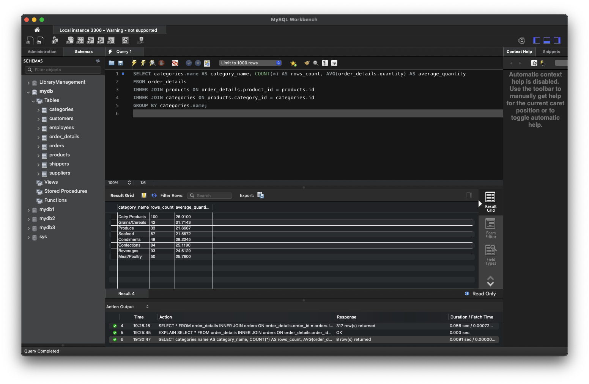
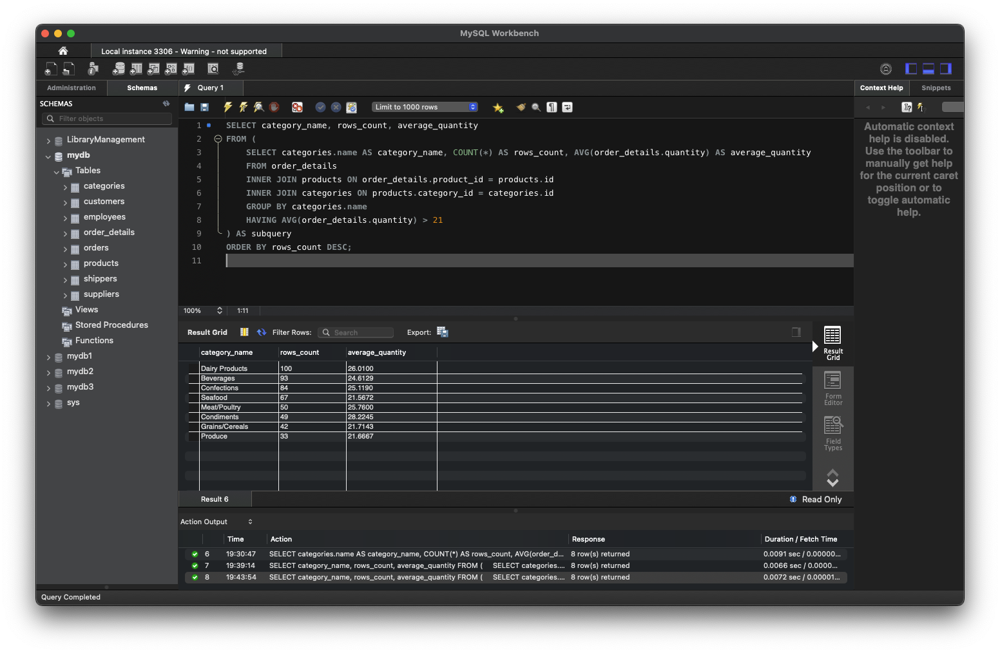

# goit-rdb-hw-04

## Завдання 1

Створіть базу даних для керування бібліотекою книг згідно зі структурою, наведеною нижче. Використовуйте DDL-команди для створення необхідних таблиць та їх зв'язків.

### Структура БД

a) Назва схеми — “LibraryManagement”

b) Таблиця "authors":

- author_id (INT, автоматично зростаючий PRIMARY KEY)
- author_name (VARCHAR)

c) Таблиця "genres":

- genre_id (INT, автоматично зростаючий PRIMARY KEY)
- genre_name (VARCHAR)

d) Таблиця "books":

- book_id (INT, автоматично зростаючий PRIMARY KEY)
- title (VARCHAR)
- publication_year (YEAR)
- author_id (INT, FOREIGN KEY зв'язок з "Authors")
- genre_id (INT, FOREIGN KEY зв'язок з "Genres")

e) Таблиця "users":

- user_id (INT, автоматично зростаючий PRIMARY KEY)
- username (VARCHAR)
- email (VARCHAR)

f) Таблиця "borrowed_books":

- borrow_id (INT, автоматично зростаючий PRIMARY KEY)
- book_id (INT, FOREIGN KEY зв'язок з "Books")
- user_id (INT, FOREIGN KEY зв'язок з "Users")
- borrow_date (DATE)
- return_date (DATE)

## Розвязання завдання 1


```sql
CREATE SCHEMA LibraryManagement;

USE LibraryManagement;

CREATE TABLE authors (
    author_id INT AUTO_INCREMENT PRIMARY KEY,
    author_name VARCHAR(255) NOT NULL
);

CREATE TABLE genres (
    genre_id INT AUTO_INCREMENT PRIMARY KEY,
    genre_name VARCHAR(255) NOT NULL
);

CREATE TABLE books (
    book_id INT AUTO_INCREMENT PRIMARY KEY,
    title VARCHAR(255) NOT NULL,
    publication_year YEAR NOT NULL,
    author_id INT NOT NULL,
    genre_id INT NOT NULL,
    FOREIGN KEY (author_id) REFERENCES authors (author_id),
    FOREIGN KEY (genre_id) REFERENCES genres (genre_id)
);

CREATE TABLE users (
    user_id INT AUTO_INCREMENT PRIMARY KEY,
    username VARCHAR(255) NOT NULL,
    email VARCHAR(255) NOT NULL
);

CREATE TABLE borrowed_books (
    borrow_id INT AUTO_INCREMENT PRIMARY KEY,
    book_id INT NOT NULL,
    user_id INT NOT NULL,
    borrow_date DATE,
    return_date DATE,
    FOREIGN KEY (book_id) REFERENCES books (book_id),
    FOREIGN KEY (user_id) REFERENCES users (user_id)
);
```

## Завдання 2

Заповніть таблиці простими видуманими тестовими даними. Достатньо одного-двох рядків у кожну таблицю.

## Розвязання завдання 2


```sql
INSERT INTO authors (author_name) VALUES
('J.K. Rowling'),
('J.R.R. Tolkien');

INSERT INTO genres (genre_name) VALUES
('Science Fiction'),
('Fantasy');

INSERT INTO books (title, publication_year, author_id, genre_id) VALUES
('Harry Potter and the Philosopher\'s Stone', 1997, 1, 2),
('The Lord of the Rings: The Fellowship of the Ring', 1954, 2, 2);

INSERT INTO users (username, email) VALUES
('Oleh Sidorov', 'oleh.sidorov@example.com'),
('Maryna Petrenko', 'maryna.petrenko@example.com');

INSERT INTO borrowed_books (book_id, user_id, borrow_date, return_date) VALUES
(1, 1, '2023-10-01', '2023-11-01'),
(2, 2, '2023-10-05', '2023-11-05');

SELECT * FROM borrowed_books;
```

## Завдання 3

Перейдіть до бази даних, з якою працювали у темі 3. Напишіть запит за допомогою операторів FROM та INNER JOIN, що об’єднує всі таблиці даних, які ми завантажили з файлів: order_details, orders, customers, products, categories, employees, shippers, suppliers. Для цього ви маєте знайти спільні ключі.

Перевірте правильність виконання запиту.

## Розвязання завдання 3


```sql
SELECT
  order_details.order_id,
  order_details.product_id,
  order_details.quantity,
  products.price as order_price,
  o.date as order_date,
  customers.name as customer_name,
  customers.contact as customer_contact,
  customers.address as customer_address,
  customers.city as customer_city,
  customers.postal_code as customer_postal_code,
  customers.country as customer_country,
  products.name as product_name,
  categories.name as category_name,
  categories.description as category_description,
  employees.first_name as employee_first_name,
  employees.last_name as employee_last_name,
  employees.birthdate as employee_birthdate,
  employees.photo as employee_photo,
  employees.notes as employee_notes,
  shippers.name as shipper_name,
  shippers.phone as shipper_phone,
  suppliers.name as supplier_name,
  suppliers.contact as supplier_contact,
  suppliers.address as supplier_address,
  suppliers.city as supplier_city,
  suppliers.postal_code as supplier_postal_code,
  suppliers.country as supplier_country
FROM
  order_details
  INNER JOIN orders AS o ON order_details.order_id = o.id
  INNER JOIN customers ON o.customer_id = customers.id
  INNER JOIN products ON order_details.product_id = products.id
  INNER JOIN categories ON products.category_id = categories.id
  INNER JOIN employees ON o.employee_id = employees.employee_id
  INNER JOIN shippers ON o.shipper_id = shippers.id
  INNER JOIN suppliers ON products.supplier_id = suppliers.id;
```

## Завдання 4

Виконайте запити, перелічені нижче.

1. Визначте, скільки рядків ви отримали (за допомогою оператора COUNT).

2. Змініть декілька операторів INNER на LEFT чи RIGHT. Визначте, що відбувається з кількістю рядків. Чому? Напишіть відповідь у текстовому файлі.
3. Оберіть тільки ті рядки, де employee_id > 3 та ≤ 10.
4. Згрупуйте за іменем категорії, порахуйте кількість рядків у групі, середню кількість товару (кількість товару знаходиться в order_details.quantity)
5. Відфільтруйте рядки, де середня кількість товару більша за 21.
6. Відсортуйте рядки за спаданням кількості рядків.
7. Виведіть на екран (оберіть) чотири рядки з пропущеним першим рядком.

## Розвязання завдання 4

## 1 

```sql
SELECT COUNT(*)
FROM order_details
INNER JOIN orders ON order_details.order_id = orders.id
INNER JOIN customers ON orders.customer_id = customers.id
INNER JOIN products ON order_details.product_id = products.id
INNER JOIN categories ON products.category_id = categories.id
INNER JOIN employees ON orders.employee_id = employees.employee_id
INNER JOIN shippers ON orders.shipper_id = shippers.id
INNER JOIN suppliers ON products.supplier_id = suppliers.id;
```

## 2

LEFT

```sql
SELECT *
FROM order_details
LEFT JOIN orders ON order_details.order_id = orders.id
LEFT JOIN customers ON orders.customer_id = customers.id
LEFT JOIN products ON order_details.product_id = products.id
LEFT JOIN categories ON products.category_id = categories.id
LEFT JOIN employees ON orders.employee_id = employees.employee_id
LEFT JOIN shippers ON orders.shipper_id = shippers.id
LEFT JOIN suppliers ON products.supplier_id = suppliers.id;
```

RIGHT

```sql
SELECT *
FROM order_details
RIGHT JOIN orders ON order_details.order_id = orders.id
RIGHT JOIN customers ON orders.customer_id = customers.id
RIGHT JOIN products ON order_details.product_id = products.id
RIGHT JOIN categories ON products.category_id = categories.id
RIGHT JOIN employees ON orders.employee_id = employees.employee_id
RIGHT JOIN shippers ON orders.shipper_id = shippers.id
RIGHT JOIN suppliers ON products.supplier_id = suppliers.id;
```

## Результат тесту

```sql
При змінні INNER на LEFT показує 518 рядків
При змінні LEFT на RIGHT процес виконується довго і показує помилку Error Code: Lost connection to MySQL server during query
```

## 3 

```sql
SELECT *
FROM order_details
INNER JOIN orders ON order_details.order_id = orders.id
INNER JOIN customers ON orders.customer_id = customers.id
INNER JOIN products ON order_details.product_id = products.id
INNER JOIN categories ON products.category_id = categories.id
INNER JOIN employees ON orders.employee_id = employees.employee_id
INNER JOIN shippers ON orders.shipper_id = shippers.id
INNER JOIN suppliers ON products.supplier_id = suppliers.id
WHERE employees.employee_id > 3 AND employees.employee_id <= 10;
```

## 4 

```sql
SELECT categories.name AS category_name, COUNT(*) AS rows_count, AVG(order_details.quantity) AS average_quantity
FROM order_details
INNER JOIN products ON order_details.product_id = products.id
INNER JOIN categories ON products.category_id = categories.id
GROUP BY categories.name;
```

## 5 

```sql
SELECT category_name, rows_count, average_quantity
FROM (
    SELECT categories.name AS category_name, COUNT(*) AS rows_count, AVG(order_details.quantity) AS average_quantity
    FROM order_details
    INNER JOIN products ON order_details.product_id = products.id
    INNER JOIN categories ON products.category_id = categories.id
    GROUP BY categories.name
) AS subquery
WHERE average_quantity > 21;
```

## 6 

```sql
SELECT category_name, rows_count, average_quantity
FROM (
    SELECT categories.name AS category_name, COUNT(*) AS rows_count, AVG(order_details.quantity) AS average_quantity
    FROM order_details
    INNER JOIN products ON order_details.product_id = products.id
    INNER JOIN categories ON products.category_id = categories.id
    GROUP BY categories.name
    HAVING AVG(order_details.quantity) > 21
) AS subquery
ORDER BY rows_count DESC;
```

## 7 

```sql
SELECT category_name, rows_count, average_quantity
FROM (
    SELECT categories.name AS category_name, COUNT(*) AS rows_count, AVG(order_details.quantity) AS average_quantity
    FROM order_details
    INNER JOIN products ON order_details.product_id = products.id
    INNER JOIN categories ON products.category_id = categories.id
    GROUP BY categories.name
    HAVING AVG(order_details.quantity) > 21
    ORDER BY rows_count DESC
) AS subquery
LIMIT 3 OFFSET 1;
```
